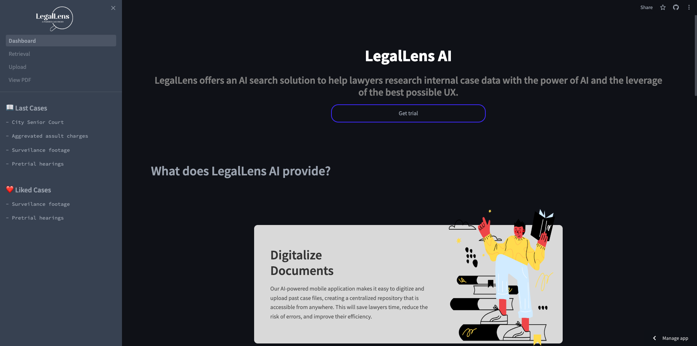
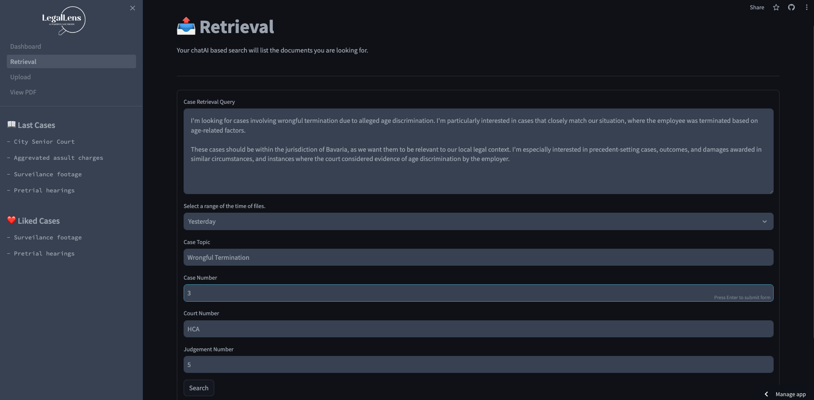

# 👋 LegalsLens AI


---

---

## Links to our LegalLens AI's Github Repo

[LegalLensAI on Github](https://github.com/SimonBurmer/TUM-TechChallenge/)

## Out goal - The Legal Precision of AI: Digitalization, Deep Matching and Rapid Retrieval in Legal Tech

- Our solution ensures data privacy by allowing clients to deploy their data locally, providing a comprehensive legal tech platform for seamless digitalization: data conversion, similarity search, and summarization.
- Leveraging a fine-tuned legal language model, our solution excels in accuracy and speed, enabling swift retrieval and deep matching within extensive legal data entries using vector database search engine.
- Efficiently presenting key legal information, our AI-generated summaries offer lawyers insights into relevant documents and their significance in searches.

## See our product in action:

### Landing page:

[](https://dashboardpy-ch84rdhq7jjflzmepsla98.streamlit.app/)

### Upload documents:

[](https://dashboardpy-ch84rdhq7jjflzmepsla98.streamlit.app/Upload)

### Retrieval:

[](https://dashboardpy-ch84rdhq7jjflzmepsla98.streamlit.app/Retrieval)

## Installation

### Getting started

```
# create conda environment
conda create -n LegalLensAI python==3.9
conda activate LegalLensAI
pip install requirements.txt
```

### Basics

```
#run the entire app
streamlit run Dashboard.py
```

### Try out the AI experience 🛰🤖

```
# 1. add your OpenAI API key in the API_Key.py file
# 2. run the app 
# 3. Open the "AI Test Case" in the retriever or upload your own case and open it to see the AI Summary 
# 4. Open one of the documents of your uploaded case or of the "AI Test Case" to see the per file evaluations

streamlit run Dashboard.py

# troubleshooting: manually install "pip install openai==1.9.0" & "pip install pdfminer.six==20231228"
```

### Retrieval AI pipeline

```
#upload all documents and create embeddings in vector database
cd retriever
python ingest.py

#run the simple demo created specifically for displaying the retrieval functinality
streamlit run app.py
```

### Juicy Demo

Here's an image of the beginning of the app, landing page view:



Here is an image of the retrieving documents with query




Here is an image of the detail view of file


Here is an image of the uploading the files


## Technical Details

We built a Webapp on the [Streamlit](https://streamlit.io/) Framework. It provides a simple layout which we only had to adapt a little to our preferences.
Streamlit is really popular for additional adding of ML-Models/Ai integration for the future and convenient for demo purpose.
With regard to scaling in the future, other more mature front end technology, like Angular, can also be considered to apply detail UI features.

For the main app starting from `./Dashboard.py`, we have build several pages with UI/UX functions that offer the full legal process of using our product: upload, retrieval of documents, and display of a relevant document. We have mocked the displayed documents, AI result, and relevant information due to a lack of real legal files and anonymity of real legal data. However, all the necessary functions and AI pipeline have been set up in `retriever` once there are real legal files provided.

In `./retriever` module, we have provided a group of AI functions to embed documents, retrieve semantic similar documents, and generate AI summaries using [Langchain](https://www.langchain.com/), [HuggingFace](https://huggingface.co/), and [FAISS vector database](https://github.com/facebookresearch/faiss). The setup of the pipeline is based on the idea of `Retrieval Augmented Generation` pipeline. Besides the retrieval of semantically similar documents, it is also possible to build up a Question-Answer or Chat Bot based on the retrieved documents using relevant pipeline from Langchain. In the code, [Llama2 7b](https://ai.meta.com/llama/) is chosen as large language model for generation, and default `sentence-transformers/all-mpnet-base-v2` sentencebert model from Huggingface is used as embedding model for vector database. They can be changed into other open source models or openai models for different performances.

For a simple overlook of the techstack:


### Data uploading & processing (Langchain, Streamlit, mobile solutions)

- Clients upload relevant supporting documents for better case identification.
- Lawyers refine legal facts, legal issues, filters of jurisdiction, and supporting pdfs, audio speeches, and images.
- Law firm upload primary sources, secondary sourcces and past cases data.

### Documents matching (Tokenizer of choice (OpenAI, SentenceBert Embeddings), Vector Database FAISS)

- Refined legal query of research with supporting files pass to vector database.
- Similarity search of all datapoints best matching the query is performed.

### Results delivery (LLMs of choice (Huggingface, OpenAI), Langchain, Streamlit)

- Relevant legal research documents and legal datapoints visualized and returned.
- Summaries and insights from matched legal cases.

### Folder Structure:

- The root of the repo contains the entry point for main dashboard.
- `data` folder stores the media files that is used, including images and mock legal files.
- `retriever` folder stores the source code for the retrieval pipeline using langchain and streamlit, including the utilities functions to retrieve and a simple demo of retrieval funciton.
- `pages0` includes all the subpage of the main app using streamlit.
- `utils` includes the helper funcitons for the main app.
